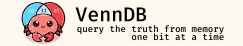

[![Crates.io][crates-badge]][crates-url]
[![Docs.rs][docs-badge]][docs-url]
[![MIT License][license-mit-badge]][license-mit-url]
[![Apache 2.0 License][license-apache-badge]][license-apache-url]
[![rust version][rust-version-badge]][rust-version-url]
[![Build Status][actions-badge]][actions-url]

[![Discord][discord-badge]][discord-url]
[![Buy Me A Coffee][bmac-badge]][bmac-url]
[![GitHub Sponsors][ghs-badge]][ghs-url]

[crates-badge]: https://img.shields.io/crates/v/venndb.svg
[crates-url]: https://crates.io/crates/venndb
[docs-badge]: https://img.shields.io/docsrs/venndb/latest
[docs-url]: https://docs.rs/venndb/latest/venndb/index.html
[license-mit-badge]: https://img.shields.io/badge/license-MIT-blue.svg
[license-mit-url]: https://github.com/plabayo/venndb/blob/main/LICENSE-MIT
[license-apache-badge]: https://img.shields.io/badge/license-APACHE-blue.svg
[license-apache-url]: https://github.com/plabayo/venndb/blob/main/LICENSE-APACHE
[rust-version-badge]: https://img.shields.io/badge/rustc-1.75+-blue?style=flat-square&logo=rust
[rust-version-url]: https://www.rust-lang.org
[actions-badge]: https://github.com/plabayo/venndb/workflows/CI/badge.svg
[actions-url]: https://github.com/plabayo/venndb/actions

[discord-badge]: https://img.shields.io/badge/Discord-%235865F2.svg?style=for-the-badge&logo=discord&logoColor=white
[discord-url]: https://discord.gg/29EetaSYCD
[bmac-badge]: https://img.shields.io/badge/Buy%20Me%20a%20Coffee-ffdd00?style=for-the-badge&logo=buy-me-a-coffee&logoColor=black
[bmac-url]: https://www.buymeacoffee.com/plabayo
[ghs-badge]: https://img.shields.io/badge/sponsor-30363D?style=for-the-badge&logo=GitHub-Sponsors&logoColor=#EA4AAA
[ghs-url]: https://github.com/sponsors/plabayo

An in-memory database in Rust for rows queried using bit (flag) columns.
This database is designed for a very specific use case where you have mostly static data that you typically load at startup and have to query constantly using very simple filters. Datasets
like these can be large and should be both fast and compact.

This project was developed originally in function of [`rama`](https://ramaproxy.org),
where you can see it being used for example to provide an in-memory (upstream) proxy database.
Do let us know in case you use it as well in your project, such that we can assemble a showcase list.

💬 Come join us at [Discord][discord-url] on the `#venndb` public channel. To ask questions, discuss ideas and ask how venndb may be useful for you.

> ⚠️ venndb is early work in progress, use at your own risk.
>
> Not everything that exists is documented and not everything that is documented is implemented.

## ⛨ | Safety

This crate uses `#![forbid(unsafe_code)]` to ensure everything is implemented in 100% safe Rust.

## 🦀 | Compatibility

venndb is developed mostly on MacOS M-Series machines and run in production
on a variety of Linux systems. Windows support is not officially guaranteed,
but is [tested using Github Actions](https://github.com/plabayo/venndb/blob/main/.github/workflows/CI.yml) with success.

| platform | tested | test platform |
|----------|--------|---------------|
| MacOS    | ✅     | M2 (developer laptop) and macos-12 Intel ([GitHub Action](https://docs.github.com/en/actions/using-github-hosted-runners/about-github-hosted-runners/about-github-hosted-runners)) |
| Windows  | ✅     | Windows 2022 ([GitHub Action](https://docs.github.com/en/actions/using-github-hosted-runners/about-github-hosted-runners/about-github-hosted-runners)) |
| Linux    | ✅     | Ubuntu 22.04 ([GitHub Action](https://docs.github.com/en/actions/using-github-hosted-runners/about-github-hosted-runners/about-github-hosted-runners)) |

Please [open a ticket](https://github.com/plabayo/venndb/issues) in case you have compatibility issues for your setup/platform.
Our goal is not to support all possible platformns in the world, but we do want to
support as many as we reasonably can.

### Minimum supported Rust version

venndb's MSRV is `1.75`.

[Using GitHub Actions we also test](https://github.com/plabayo/venndb/blob/main/.github/workflows/CI.yml) if `venndb` on that version still works on
the stable and beta versions of _rust_ as well.

## 🧭 | Roadmap

Please refer to <https://github.com/plabayo/venndb/milestones> to know what's on the roadmap. Is there something not on the roadmap for the next version that you would really like? Please [create a feature request](https://github.com/plabayo/venndb/issues) to request it and [become a sponsor](#sponsors) if you can.

## 💼 | License

This project is dual-licensed under both the [MIT license][mit-license] and [Apache 2.0 License][apache-license].

## 👋 | Contributing

🎈 Thanks for your help improving the project! We are so happy to have
you! We have a [contributing guide][contributing] to help you get involved in the
`venndb` project.

Contributions often come from people who already know what they want, be it a fix for a bug they encountered,
or a feature that they are missing. Please do always make a ticket if one doesn't exist already.

It's possible however that you do not yet know what specifically to contribute, and yet want to help out.
For that we thank you. You can take a look at the open issues, and in particular:

- [`good first issue`](https://github.com/plabayo/venndb/issues?q=is%3Aissue+is%3Aopen+label%3A%22good+first+issue%22): issues that are good for those new to the `venndb` codebase;
- [`easy`](https://github.com/plabayo/venndb/issues?q=is%3Aissue+is%3Aopen+label%3Aeasy): issues that are seen as easy;
- [`mentor available`](https://github.com/plabayo/venndb/issues?q=is%3Aissue+is%3Aopen+label%3A%22mentor+available%22): issues for which we offer mentorship;
- [`low prio`](https://github.com/plabayo/venndb/issues?q=is%3Aissue+is%3Aopen+label%3A%22low+prio%22): low prio issues that have no immediate pressure to be finished quick, great in case you want to help out but can only do with limited time to spare;

In general, any issue not assigned already is free to be picked up by anyone else. Please do communicate in the ticket
if you are planning to pick it up, as to avoid multiple people trying to solve the same one.

Should you want to contribure this project but you do not yet know how to program in Rust, you could start learning Rust with as goal to contribute as soon as possible to `venndb` by using "[the Rust 101 Learning Guide](https://rust-lang.guide/)" as your study companion. Glen can also be hired as a mentor or teacher to give you paid 1-on-1 lessons and other similar consultancy services. You can find his contact details at <https://www.glendc.com/>.

### Contribution

Unless you explicitly state otherwise, any contribution intentionally submitted
for inclusion in `venndb` by you, shall be licensed as both [MIT][mit-license] and [Apache 2.0][apache-license],
without any additional terms or conditions.

[contributing]: https://github.com/plabayo/venndb/blob/main/CONTRIBUTING.md
[mit-license]: https://github.com/plabayo/venndb/blob/main/LICENSE-MIT
[apache-license]: https://github.com/plabayo/venndb/blob/main/LICENSE-APACHE

### Acknowledgements

Special thanks goes to all involved in developing, maintaining and supporting [the Rust programming language](https://www.rust-lang.org/). Also a big shoutout to the ["Write Powerful Rust Macros" book by _Sam Van Overmeire_](https://www.manning.com/books/write-powerful-rust-macros), which gave the courage to develop this crate, finally.

## 💖 | Sponsors

venndb is **completely free, open-source software** which needs lots of effort and time to develop and maintain.

Support this project by becoming a [sponsor][ghs-url]. One time payments are accepted [at GitHub][ghs-url] as well as at ["Buy me a Coffee"][bmac-url].

Sponsors help us continue to maintain and improve `venndb`, as well as other
Free and Open Source (FOSS) technology. It also helps us to create
educational content such as <https://github.com/plabayo/learn-rust-101>,
and other open source frameworks such as <https://github.com/plabayo/rama>.

Sponsors receive perks and depending on your regular contribution it also
allows you to rely on us for support and consulting.

## Example

### Read Only Database Example

```rust
use venndb::venndb;

venndb! {
    struct Employee {
        id: u32,
        name: String,
        is_manager: bool,
        is_admin: bool,
        is_active: bool,
        department: enum {
            Sales,
            Marketing,
            Engineering,
            HumanResources,
            Accounting,
        }
    }
}

fn main() {
    let db = EmployeeDB::with_capacity(100).extend(vec![
        Employee {
            id: 1,
            name: "John".to_string(),
            is_manager: true,
            is_admin: false,
            is_active: true,
            department: Department::Sales,
        },
        Employee {
            id: 2,
            name: "Jane".to_string(),
            is_manager: false,
            is_admin: true,
            is_active: true,
            department: Department::Marketing,
        },
        Employee {
            id: 3,
            name: "Bob".to_string(),
            is_manager: false,
            is_admin: false,
            is_active: false,
            department: Department::Engineering,
        },
    ]);

    let active_managers: Vec<String> = db.query()
        .is_manager()
        .is_active()
        .run()
        .map(|employee| employee.name)
        .collect();

    assert_eq!(active_managers, vec!["John".to_string()]);
}
```

The above example show how easy it is to create an in-memory database
with little effort while still being powerful and easy to use.

What's going om under the hood? High level the following is generated
(use `cargo expand` to see the fully generated code):

```rust
#[derive(Debug, venndb::Serialize, venndb::Deserialize)]
struct Employee {
    pub id: u32,
    pub name: String,
    pub is_manager: bool,
    pub is_admin: bool,
    pub is_active: bool,
    pub department: EmployeeDepartment,
}

#[derive(Debug, venndb::Serialize, venndb::Deserialize)]
enum EmployeeDepartment {
    Sales,
    Marketing,
    Engineering,
    HumanResources,
    Accounting,
}

#[derive(Debug)]
struct EmployeeDB {
    employees: Vec<Employee>,
    is_manager: venndb::BitVec,
    is_admin: venndb::BitVec,
    is_active: venndb::BitVec,
    departments: venndb::BitMap<EmployeeDepartment>,
}

struct EmployeeDBQueryBuilder<'a> {
    db: &'a EmployeeDB,

    ...
}

impl EmployeeDB {
    fn new() -> Self { ... }
    fn with_capacity(capacity: usize) -> Self { ... }

    fn extend(&mut self, employees: impl IntoIterator<Item = Employee>) { ... }

    fn query(&self) -> EmployeeDBQueryBuilder { ... }

    fn iter(&self) -> impl Iterator<Item = &Employee> {
        self.employees.iter()
    }
}

impl EmployeeDBQueryBuilder<'_> {
    fn is_manager(&mut self) -> &mut Self { ... }
    fn is_admin(&mut self) -> &mut Self { ... }
    fn is_active(&mut self) -> &mut Self { ... }
    fn department(&mut self, department: EmployeeDepartment) -> &mut Self { ... }

    fn run(self) -> impl Iterator<Item = &Employee> { ... }
}

impl Iterator for EmployeeDB<'_> {
    type Item = &'_ Employee;

    fn next(&mut self) -> Option<Self::Item> { ... }
}

impl IntoIterator for EmployeeDB {
    type Item = Employee;
    type IntoIter = std::vec::IntoIter<Self::Item>;

    fn into_iter(self) -> Self::IntoIter {
        self.employees.into_iter()
    }
}
```

### Mutate Example

Should you need to mutate the database, you can do so with
a couple of changes.

First the venndb creation has to be change a bit:

venndb! {
    struct Employee {
        #[venndb::key]
        id: u32,
        name: String,
        is_manager: bool,
        is_admin: bool,
        is_active: bool,
        department: enum {
            Sales,
            Marketing,
            Engineering,
            HumanResources,
            Accounting,
        }
    }
}

Note the use of the `#[venndb::key]` attribute on the `id` field,
which will ensure that internally we generate a `venndb::FxHashMap<u32, usize>`
property in the actual `EmployeeDB` struct.

Then we can mutate previously queried employees as follows:

```rust
db.get_mut(1).unwrap().is_manager = false; // John is no longer a manager
```

Without modifications we can however also query mutable:

```rust
// fire all the managers
let active_managers: Vec<&mut Employee> = db.mutate()
    .is_manager()
    .is_active()
    .run()
    .map(|employee| employee.is_active = false);
```
